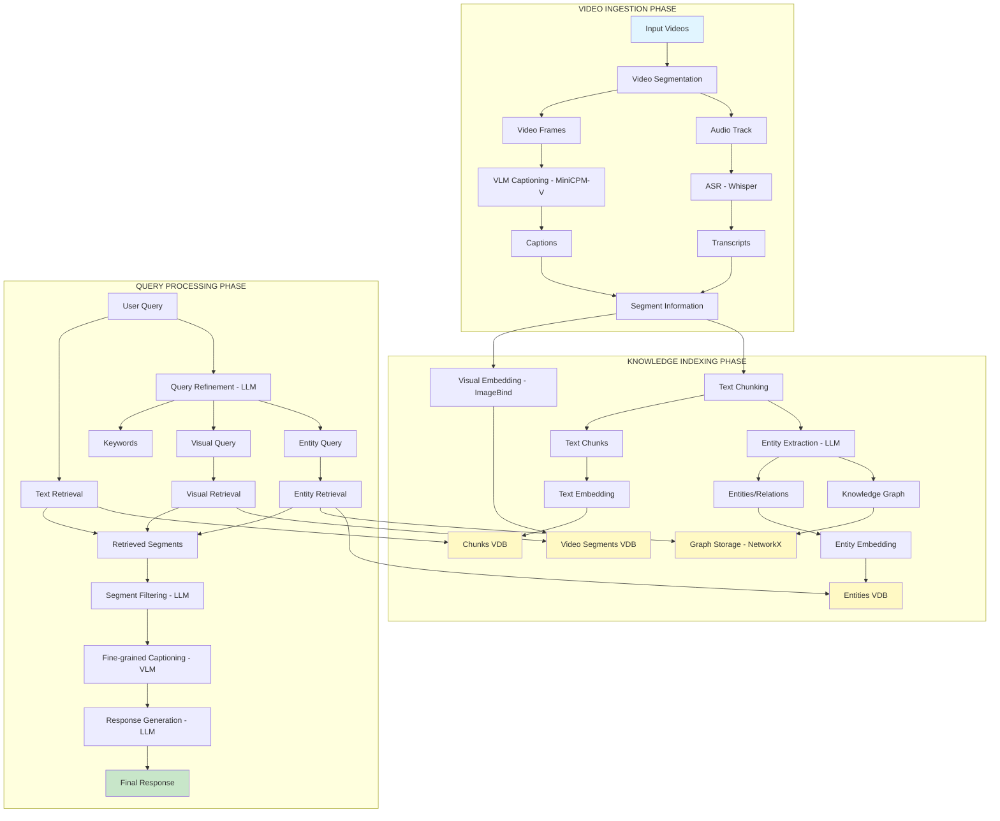
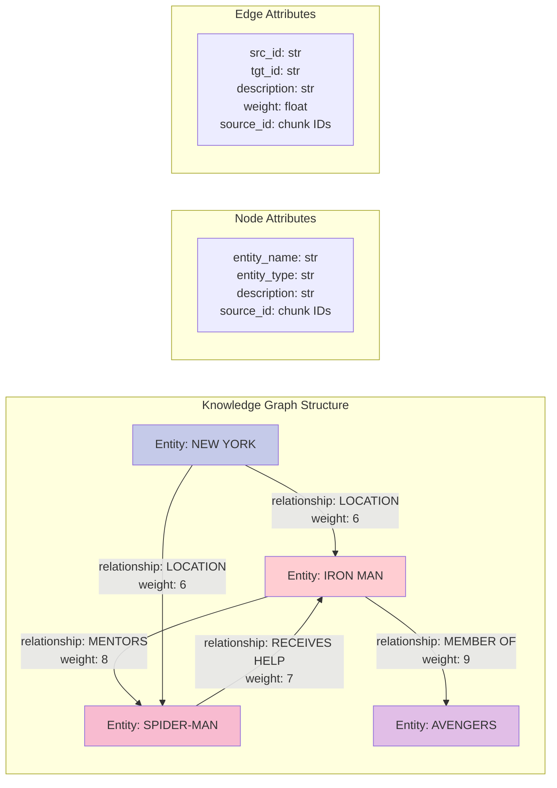
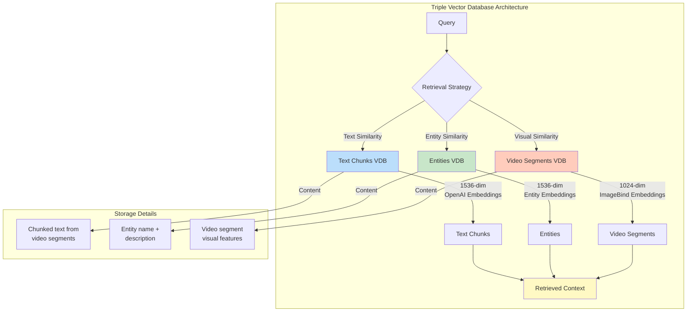
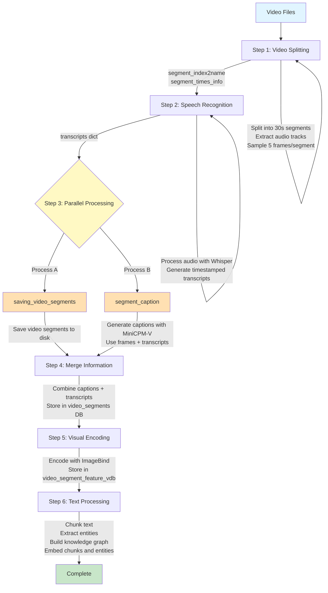
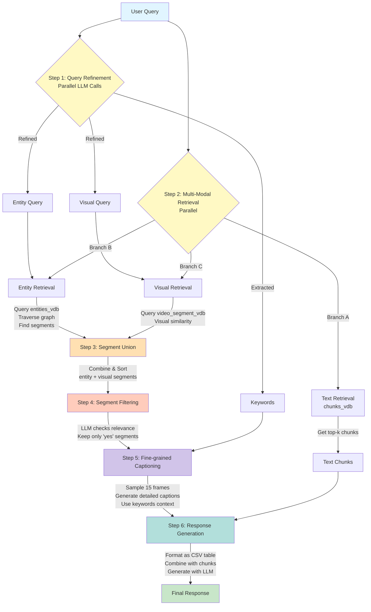
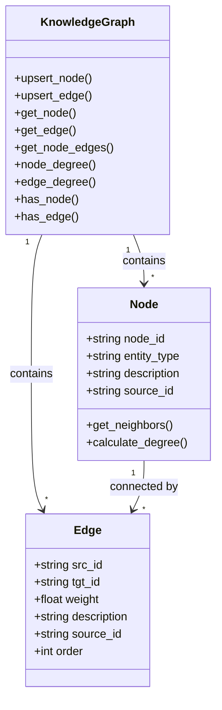

# VideoRAG Technical Documentation

## Table of Contents
1. [Overview](#overview)
2. [System Architecture](#system-architecture)
3. [Core Concepts](#core-concepts)
4. [Component Details](#component-details)
5. [Data Flow](#data-flow)
6. [Storage Systems](#storage-systems)
7. [Query Processing Pipeline](#query-processing-pipeline)
8. [Technical Implementation](#technical-implementation)
9. [Performance Considerations](#performance-considerations)

---

## Overview

**VideoRAG** (Video Retrieval-Augmented Generation) is a sophisticated framework designed to process and understand extremely long-context videos through a dual-channel architecture that combines:
- **Graph-driven textual knowledge grounding** for semantic relationships
- **Hierarchical multimodal context encoding** for spatiotemporal visual patterns

### Key Capabilities
- Process hundreds of hours of video content on a single NVIDIA RTX 3090 (24GB)
- Multi-modal knowledge indexing into structured knowledge graphs
- Hybrid retrieval combining textual semantics and visual content
- Support for unbounded-length video understanding

---

## System Architecture



---

## Core Concepts

### 1. Video Segmentation
Videos are split into manageable segments (default: 30 seconds) to enable:
- Parallel processing
- Granular retrieval
- Memory-efficient handling
- Temporal localization

**Key Parameters:**
- `video_segment_length`: 30 seconds (default)
- `rough_num_frames_per_segment`: 5 frames for initial captioning
- `fine_num_frames_per_segment`: 15 frames for query-specific captioning

### 2. Multi-Modal Knowledge Extraction

#### Audio Processing (ASR)
- **Model**: Faster-Whisper (distil-whisper-large-v3)
- **Output**: Timestamped transcripts with speaker information
- **Format**: `[start_time -> end_time] transcript_text`

#### Visual Processing (VLM)
- **Model**: MiniCPM-V-2.6 (4-bit quantized)
- **Input**: Video frames + transcript context
- **Output**: Detailed scene descriptions

#### Combined Representation
Each segment contains:
```python
{
    "content": "Caption:\n{caption}\nTranscript:\n{transcript}",
    "time": "start-end",
    "transcript": "{raw_transcript}",
    "frame_times": [t1, t2, ..., tn]
}
```

### 3. Knowledge Graph Construction

#### Entity Extraction
Uses LLM-based extraction to identify:
- **Entities**: People, organizations, locations, events, concepts
- **Relationships**: Connections between entities with strength scores
- **Descriptions**: Comprehensive entity attributes

**Process:**
1. Text chunking (1200 tokens per chunk)
2. LLM extraction with gleaning (iterative refinement)
3. Entity/relationship merging and deduplication
4. Summary generation for long descriptions

#### Graph Structure



### 4. Triple Vector Database System



#### a) Text Chunks VDB
- **Purpose**: Naive RAG retrieval
- **Embedding**: Text embeddings (OpenAI text-embedding-3-small, 1536-dim)
- **Content**: Chunked text from video segments

#### b) Entities VDB
- **Purpose**: Entity-based retrieval
- **Embedding**: Entity name + description
- **Content**: Extracted entities from knowledge graph

#### c) Video Segments VDB
- **Purpose**: Visual similarity retrieval
- **Embedding**: ImageBind visual embeddings (1024-dim)
- **Content**: Video segment features
- **Model**: ImageBind (multimodal alignment)

---

## Component Details

### VideoRAG Main Class

```python
@dataclass
class VideoRAG:
    # Core configuration
    working_dir: str
    
    # Video processing
    video_segment_length: int = 30
    rough_num_frames_per_segment: int = 5
    fine_num_frames_per_segment: int = 15
    
    # Retrieval
    retrieval_topk_chunks: int = 2
    segment_retrieval_top_k: int = 4
    
    # LLM configuration
    llm: LLMConfig
    
    # Storage backends
    key_string_value_json_storage_cls: Type[BaseKVStorage]
    vector_db_storage_cls: Type[BaseVectorStorage]
    graph_storage_cls: Type[BaseGraphStorage]
```

### Storage Components

#### 1. Key-Value Storage (JSON)
```python
class JsonKVStorage:
    - video_path_db: Maps video names to file paths
    - video_segments: Stores segment information
    - text_chunks: Stores chunked text data
    - llm_response_cache: Caches LLM responses
```

#### 2. Vector Storage (NanoVectorDB)
```python
class NanoVectorDBStorage:
    - Cosine similarity search
    - Batch embedding support
    - Persistent storage
    - Threshold-based filtering
```

#### 3. Graph Storage (NetworkX)
```python
class NetworkXStorage:
    - Node/edge operations
    - Degree calculations
    - Relationship traversal
    - Community detection support
```

---

## Data Flow

### Insertion Pipeline



### Query Pipeline



---

## Storage Systems

### 1. JSON Key-Value Storage

**Purpose**: Persistent storage for structured data

**Implementation**:
```python
class JsonKVStorage(BaseKVStorage):
    - File-based JSON storage
    - Async operations
    - Filtering and batch operations
    - Automatic persistence
```

**Stored Data**:
- `video_path_db`: `{video_name: video_path}`
- `video_segments`: `{video_name: {segment_id: segment_info}}`
- `text_chunks`: `{chunk_id: chunk_data}`
- `llm_response_cache`: `{hash: response}`

### 2. Vector Database (NanoVectorDB)

**Purpose**: Efficient similarity search

**Features**:
- Cosine similarity metric
- HNSW-like indexing
- Batch embedding
- Threshold filtering

**Three Instances**:

#### Chunks VDB
```python
{
    "__id__": "chunk-{hash}",
    "__vector__": [1536-dim embedding],
    "content": "text content"
}
```

#### Entities VDB
```python
{
    "__id__": "ent-{hash}",
    "__vector__": [1536-dim embedding],
    "entity_name": "ENTITY_NAME",
    "content": "name + description"
}
```

#### Video Segments VDB
```python
{
    "__id__": "video_name_segment_id",
    "__vector__": [1024-dim ImageBind embedding],
    "__video_name__": "video_name",
    "__index__": "segment_id"
}
```

### 3. Knowledge Graph (NetworkX)

**Purpose**: Semantic relationship modeling



**Structure**:
```python
Nodes: {
    node_id: {
        "entity_type": str,
        "description": str,
        "source_id": str  # Chunk IDs separated by <SEP>
    }
}

Edges: {
    (src_id, tgt_id): {
        "weight": float,
        "description": str,
        "source_id": str,
        "order": int
    }
}
```

**Operations**:
- Node/edge insertion and retrieval
- Degree calculation
- Neighbor traversal
- Community detection (optional)

---

## Query Processing Pipeline

### Phase 1: Query Refinement

Three parallel LLM calls to refine the query:

#### 1. Entity Retrieval Query
```
Input: "What is the relationship between Iron Man and Spider-Man?"
Output: "The relationship between Iron Man and Spider-Man."
```

#### 2. Visual Retrieval Query
```
Input: "What is the relationship between Iron Man and Spider-Man?"
Output: "Scenes showing Iron Man and Spider-Man together."
```

#### 3. Keywords Extraction
```
Input: "What is the relationship between Iron Man and Spider-Man?"
Output: "Iron Man, Spider-Man, relationship, interaction"
```

### Phase 2: Multi-Modal Retrieval

#### Text Retrieval (Naive RAG)
```python
results = await chunks_vdb.query(query, top_k=20)
chunks = await text_chunks_db.get_by_ids([r["id"] for r in results])
# Truncate to max token size
```

#### Entity-Based Retrieval
```python
# 1. Find relevant entities
entity_results = await entities_vdb.query(refined_query, top_k=20)

# 2. Get entity nodes from graph
node_datas = await graph.get_node(entity_name)

# 3. Find related segments
for entity in entities:
    # Get chunks containing this entity
    chunk_ids = entity["source_id"].split("<SEP>")
    
    # Get one-hop neighbors
    edges = await graph.get_node_edges(entity_name)
    
    # Find segments with high relation counts
    segments = find_segments_from_chunks(chunk_ids)
```

#### Visual Retrieval
```python
# Encode query text with ImageBind
query_embedding = encode_string_query(refined_visual_query)

# Search video segments VDB
segment_results = await video_segment_feature_vdb.query(query_embedding)
```

### Phase 3: Segment Filtering

For each retrieved segment:
```python
filter_prompt = f"""
Video Caption: {rough_caption}
Knowledge We Need: {query}
Does this segment contain relevant information? (yes/no)
"""
result = await llm(filter_prompt)
keep_segment = "yes" in result.lower()
```

### Phase 4: Fine-grained Captioning

For remaining segments:
```python
# Sample more frames (15 instead of 5)
frames = sample_frames(video, segment, num_frames=15)

# Generate detailed caption with keywords
caption_prompt = f"""
Transcript: {transcript}
Provide detailed description about: {keywords}
"""
detailed_caption = vlm(frames, caption_prompt)
```

### Phase 5: Response Generation

```python
# Format as CSV table
table = [
    ["video_name", "start_time", "end_time", "content"],
    [video1, "00:05:30", "00:08:00", caption1],
    [video2, "00:25:00", "00:28:00", caption2],
]

# Generate response
system_prompt = f"""
Retrieved Video Information:
{table}

Retrieved Text Chunks:
{chunks}

Answer the query with references.
"""
response = await llm(query, system_prompt=system_prompt)
```

---

## Technical Implementation

### Asynchronous Processing

VideoRAG uses `asyncio` for concurrent operations:

```python
# Parallel entity extraction
results = await asyncio.gather(
    *[process_chunk(chunk) for chunk in chunks]
)

# Parallel embedding
embeddings = await asyncio.gather(
    *[embedding_func(batch) for batch in batches]
)

# Parallel graph queries
nodes = await asyncio.gather(
    *[graph.get_node(entity) for entity in entities]
)
```

### Multiprocessing for Video

Heavy video processing uses multiprocessing:

```python
# Parallel video saving and captioning
process_saving = multiprocessing.Process(
    target=saving_video_segments,
    args=(video_name, video_path, ...)
)

process_caption = multiprocessing.Process(
    target=segment_caption,
    args=(video_name, video_path, ...)
)

process_saving.start()
process_caption.start()
process_saving.join()
process_caption.join()
```

### Caching Strategy

#### LLM Response Cache
```python
# Hash-based caching
args_hash = compute_args_hash(model, messages)
cached = await cache.get_by_id(args_hash)
if cached:
    return cached["return"]

# Make API call
response = await llm_api(...)

# Store in cache
await cache.upsert({args_hash: {"return": response}})
```

### Rate Limiting

```python
# Limit concurrent LLM calls
@limit_async_func_call(max_async=16)
async def llm_func(...):
    return await api_call(...)
```

### Token Management

```python
# Truncate by token size
def truncate_list_by_token_size(items, max_tokens):
    encoder = tiktoken.encoding_for_model("gpt-4o")
    total_tokens = 0
    result = []
    for item in items:
        tokens = len(encoder.encode(item["content"]))
        if total_tokens + tokens > max_tokens:
            break
        result.append(item)
        total_tokens += tokens
    return result
```

---

## Performance Considerations

### Memory Optimization

1. **4-bit Quantization**: MiniCPM-V uses 4-bit quantization
2. **Batch Processing**: Videos processed in batches
3. **Cache Cleanup**: Temporary files deleted after processing
4. **GPU Memory Management**: `torch.cuda.empty_cache()` after each segment

### Computational Efficiency

1. **Parallel Processing**: 
   - Video saving and captioning in parallel
   - Async LLM calls
   - Batch embeddings

2. **Incremental Indexing**:
   - Only new chunks processed
   - Existing entities merged
   - Graph updated incrementally

3. **Smart Retrieval**:
   - Threshold-based filtering
   - Top-k limiting
   - Two-stage captioning (rough → fine)

### Scalability

**Single Video**:
- 2-hour video: ~240 segments
- Processing time: ~30-60 minutes (RTX 3090)
- Storage: ~500MB (embeddings + metadata)

**Multiple Videos**:
- 100+ hours: Supported
- Parallel video processing: Yes
- Incremental updates: Yes

### Cost Optimization

1. **Model Selection**:
   - Cheap model (gpt-4o-mini) for query refinement
   - Best model (gpt-4o) for final response

2. **Caching**:
   - LLM responses cached
   - Embeddings cached
   - Avoid redundant API calls

3. **Batch Operations**:
   - Batch embeddings (32 texts/batch)
   - Batch video encoding (2 videos/batch)

---

## Configuration Examples

### OpenAI Configuration
```python
from videorag._llm import openai_config

videorag = VideoRAG(
    llm=openai_config,
    working_dir="./videorag-workdir",
    video_segment_length=30,
    retrieval_topk_chunks=2,
    segment_retrieval_top_k=4
)
```

### Ollama Configuration
```python
from videorag._llm import ollama_config

videorag = VideoRAG(
    llm=ollama_config,
    working_dir="./videorag-workdir"
)
```

### Custom Configuration
```python
custom_config = LLMConfig(
    embedding_func_raw=custom_embedding,
    embedding_model_name="custom-model",
    embedding_dim=768,
    best_model_func_raw=custom_llm,
    best_model_name="custom-llm",
    ...
)

videorag = VideoRAG(llm=custom_config)
```

---

## Advanced Features

### Query Modes

#### 1. VideoRAG Mode (Default)
```python
param = QueryParam(mode="videorag")
response = videorag.query(query, param)
```

#### 2. Multiple Choice Mode
```python
param = QueryParam(mode="videorag_multiple_choice")
response = videorag.query(query, param)
# Returns: {"Answer": "A", "Explanation": "..."}
```

### Reference Control

```python
# With references
param = QueryParam(wo_reference=False)
# Response includes: [1] video_name, 00:05:30, 00:08:00

# Without references
param = QueryParam(wo_reference=True)
# Response without timestamp references
```

### Response Type

```python
param = QueryParam(response_type="Multiple Paragraphs")
# or
param = QueryParam(response_type="Single Paragraph")
# or
param = QueryParam(response_type="Bullet Points")
```

---

## Error Handling

### Video Processing Errors
```python
# Error queue for multiprocessing
error_queue = manager.Queue()

# Check for errors
while not error_queue.empty():
    error_message = error_queue.get()
    log_error(error_message)
    raise RuntimeError(error_message)
```

### LLM Retry Logic
```python
@retry(
    stop=stop_after_attempt(5),
    wait=wait_exponential(multiplier=1, min=4, max=10),
    retry=retry_if_exception_type((RateLimitError, APIConnectionError))
)
async def llm_call(...):
    return await api_call(...)
```

### Graceful Degradation
```python
# If no segments remain after filtering
if len(remain_segments) == 0:
    print("Using all retrieved segments")
    remain_segments = retrieved_segments
```

---

## Conclusion

VideoRAG represents a sophisticated approach to long-context video understanding through:

1. **Multi-Modal Processing**: Combining audio (ASR), visual (VLM), and textual (LLM) modalities
2. **Hierarchical Retrieval**: Three-tier retrieval system (text, entity, visual)
3. **Knowledge Graph Integration**: Semantic relationship modeling
4. **Adaptive Captioning**: Two-stage captioning (rough → fine)
5. **Efficient Architecture**: Optimized for single-GPU processing

The system achieves state-of-the-art performance on long-context video QA tasks while maintaining computational efficiency and scalability.

---

## References

- Paper: "VideoRAG: Retrieval-Augmented Generation with Extreme Long-Context Videos"
- GitHub: https://github.com/HKUDS/VideoRAG
- Based on: nano-graphrag, LightRAG
- Models: MiniCPM-V-2.6, Whisper, ImageBind, GPT-4o
